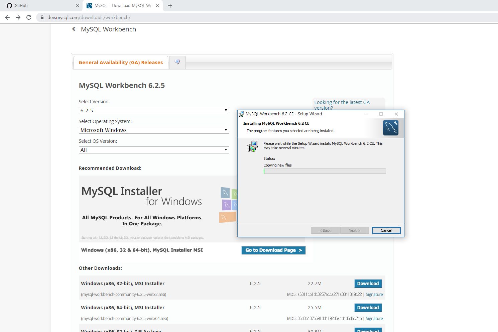
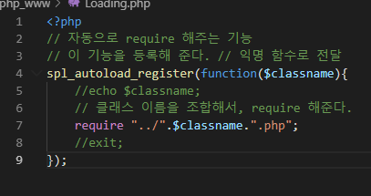
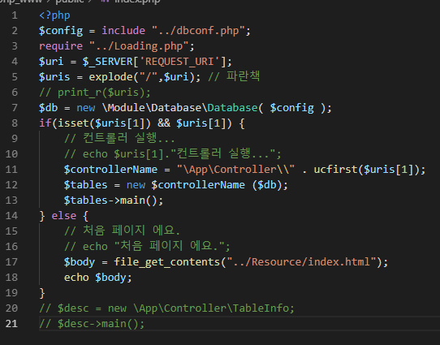
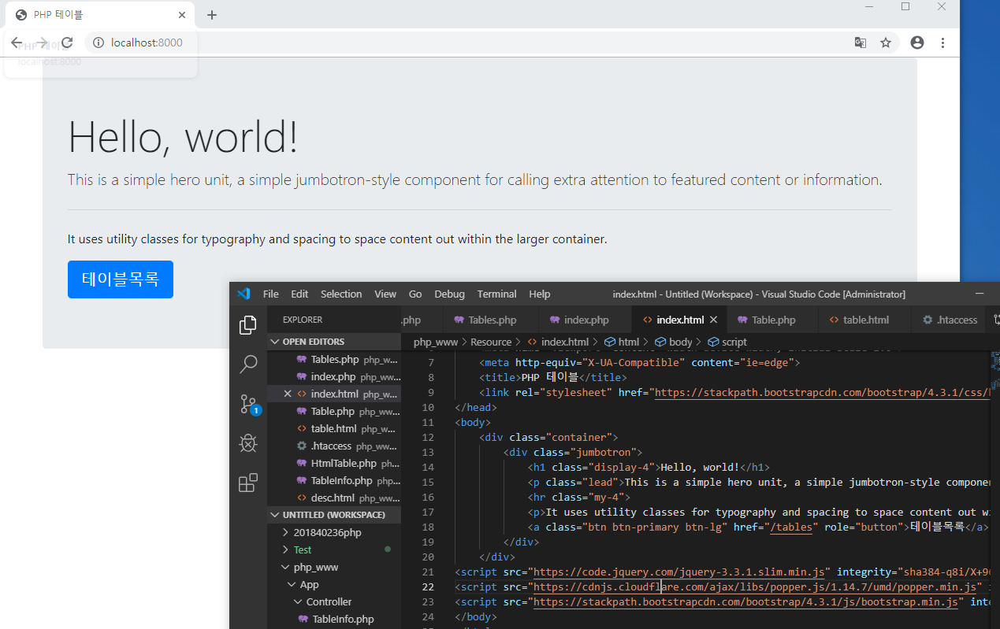
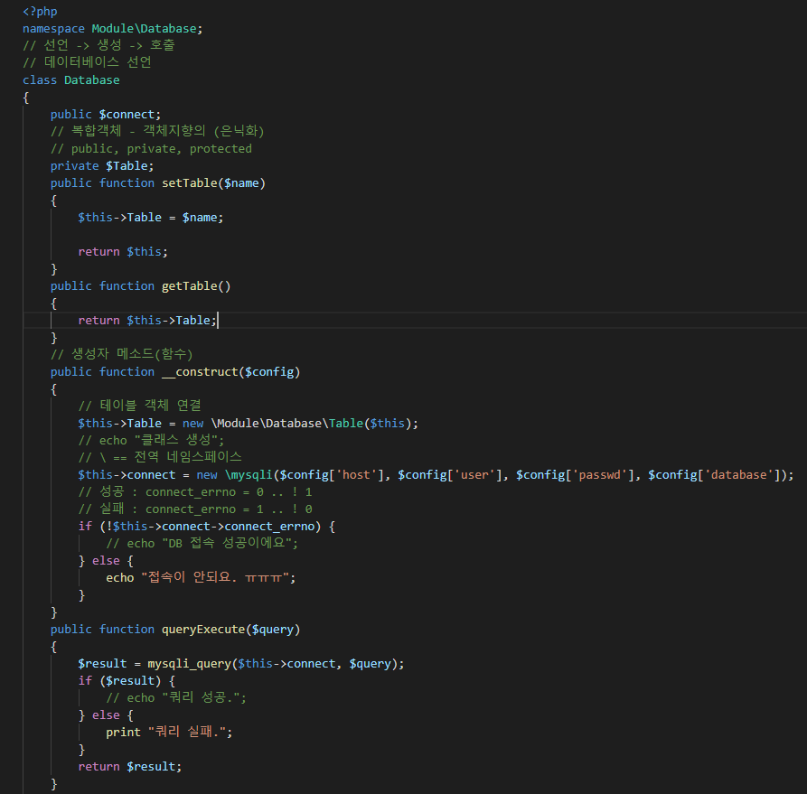
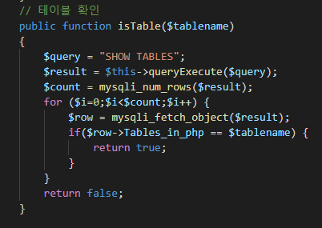
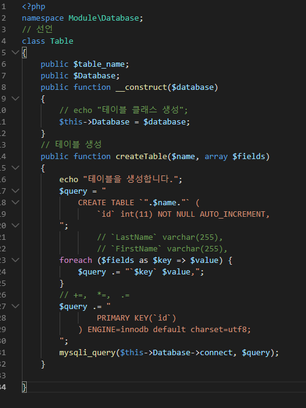
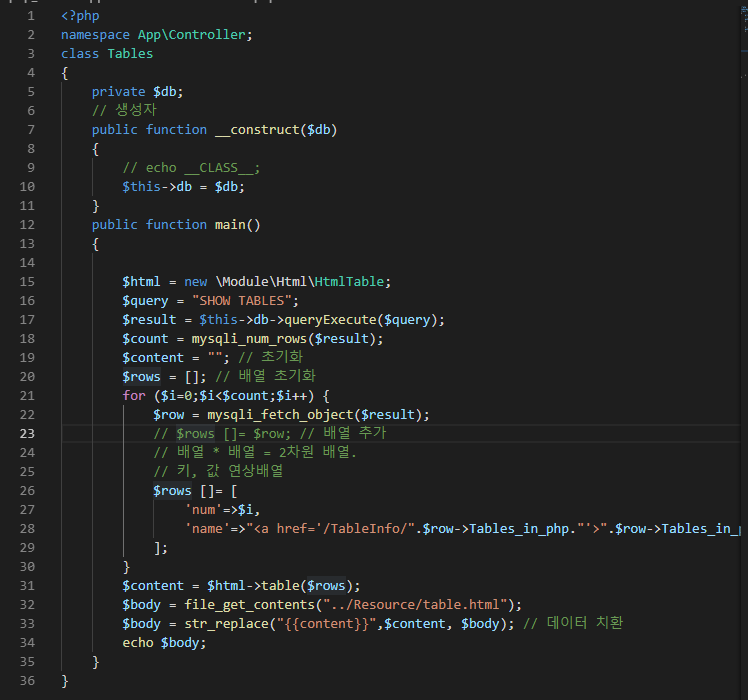
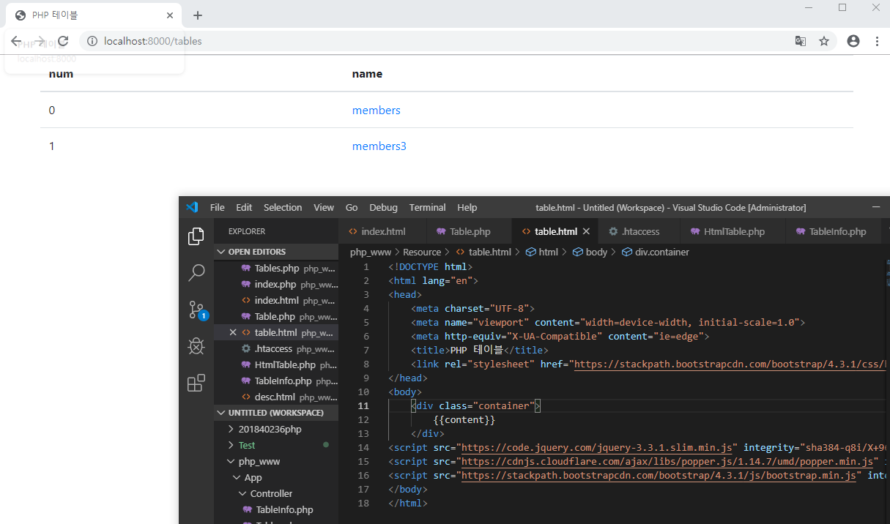
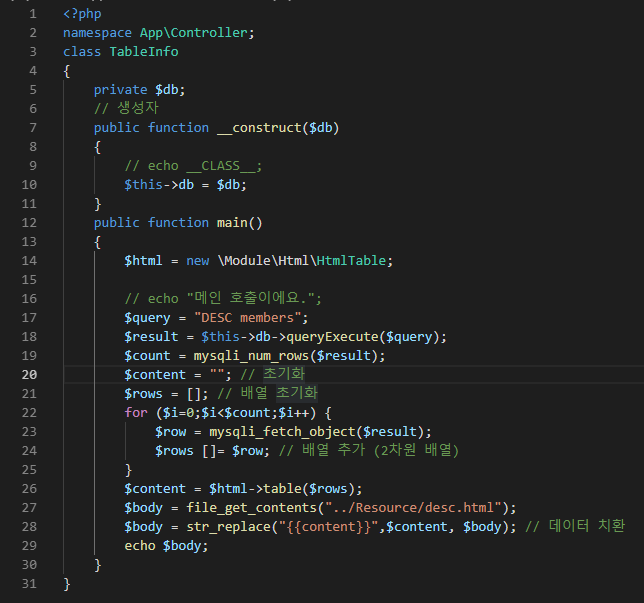

## 9주차 수업 2019.10.30

--> DB사용을 위해 mysql 워크시트를 다운받는다. 
 
--> 사용할 데이터베이스를 만들어 준다. 
 
--> mysql사용을 위해 주석처리 되어있던 명령 문들을 풀어준다 
 

--> 제작한 클래스들을 자동으로 require 해주는 기능을 제작한다. 
 

--> index.php에 Resource 폴더 안에 있는 index.html을 가져온다. 
 
--> 부트 스트랩을 이용해서 index 파일을 꾸며주었다. 
 

--> Databases.php 파일로 만들었던 DB에 접속 할 수 있다. 
 
 

--> DB와 연동 되어서 Table을 만드는 스크립트 
 

--> Tables.php를 table.html과 연결시킨다. 
--> DB에서 정보를 받아와 현재 있는 데이터 테이블을 보여준다. 
 
 

--> TableInfo.php는 desc.html과 연결한다. 
--> member에 있는 데이터 필드값을 보여주도록 한다. 
 

