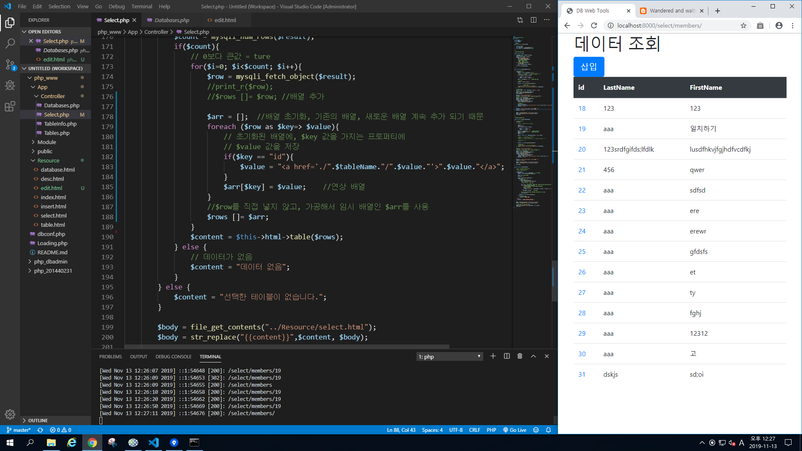
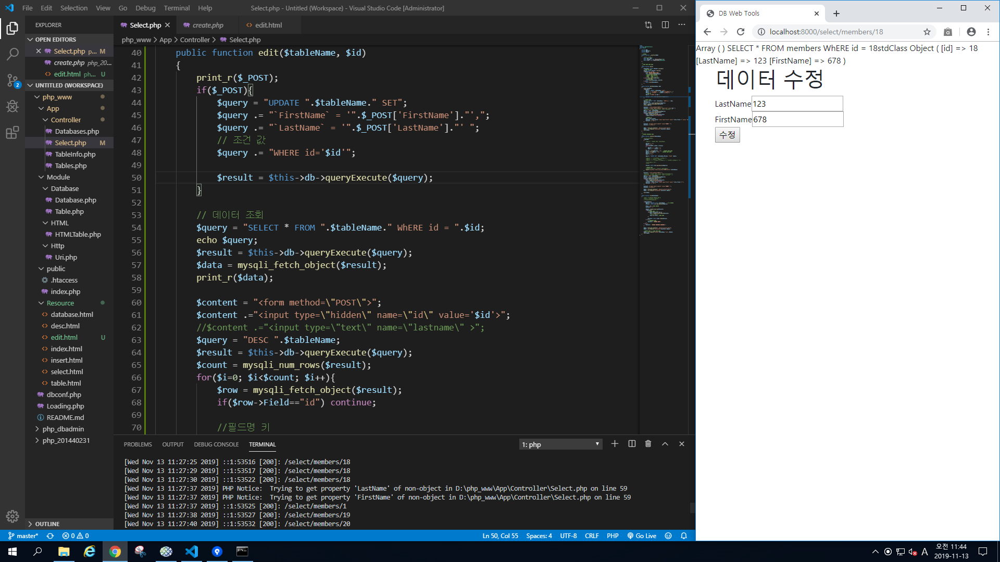
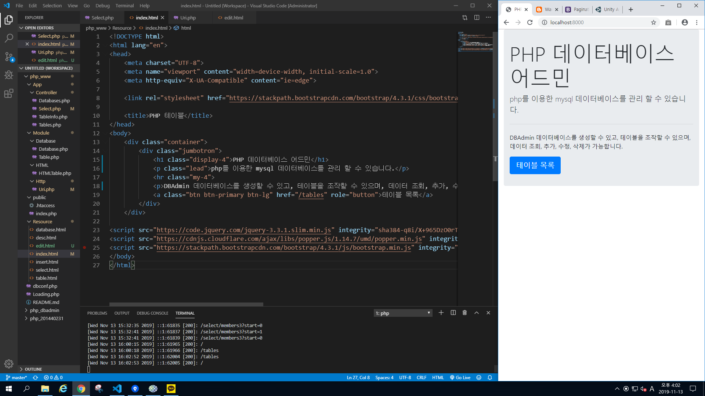
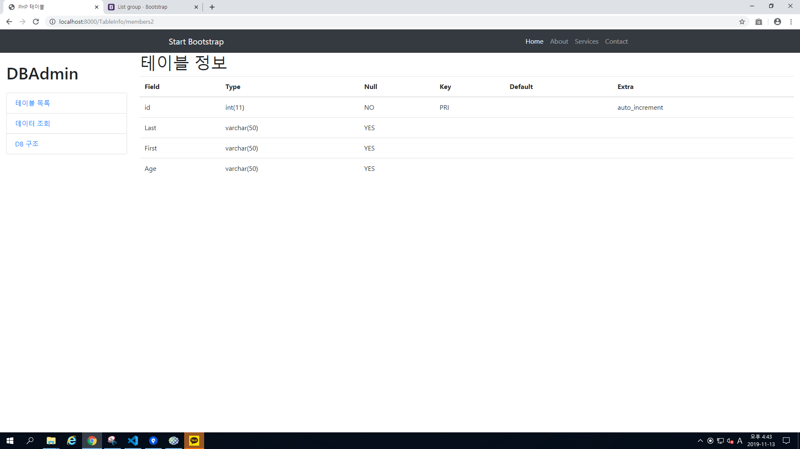
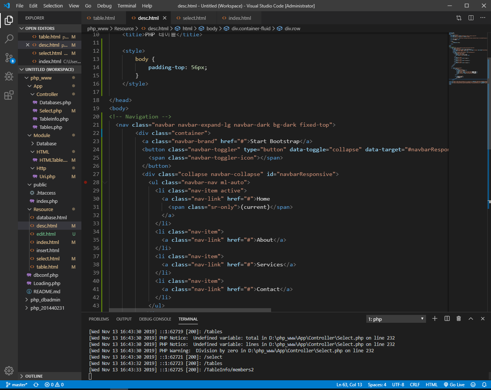

## 12주차 수업 2019.11.13

--> 부트스트랩을 이용하여 조회창을 바꾸고 데이터를 삽입하는 버튼을 만듦 
 
--> id값 클릭 시 데이터를 해당 id의 기존값을 보여주고 수정을 할 수 있도록 추가 
 
 
--> 데이터를 삭제 할 수 있게 만들수 있도록 준비 
 

--> 그전에 많은 데이터들을 깔끔하게 게시판 형식으로 보일 수 있게 부트 스트랩을 이용해서 만듦 
 
--> 총 페이지만큼 for문을 돌려 게시판 수를 만든다. 
 

--> 부트 스트랩을 이용해서 좌측 메뉴생성, 네비게이션등을 이용하여 최종적으로 꾸며주었다. (삭제기능은 다음 시간에) 
 
 
 
 
 

