## 14주차 수업 2019.11.27

인터페이스는 일종의 추상클래스, 추상메서드를 가짐 
추상클래스와 달라 일반메서드와 멤버 변수를 구성원으로 가질수 없다. 
오직 추상 메서드와 상수만을 가진다. 
주로 다른 클래스 작성에 도움을 주기위해 사용된다. 

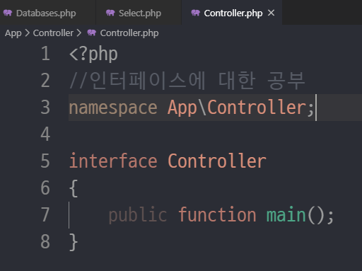 
--> PHP인터페이스를 위해서 파일을 만듦 

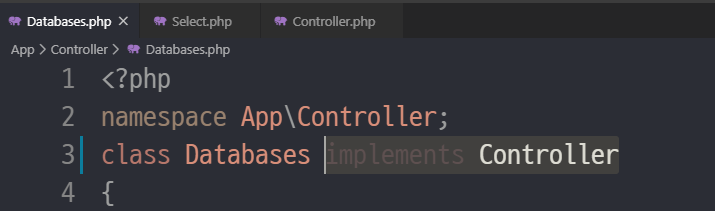 
--> interface 사용을 위해 .php파일들에 implements시킨다. 

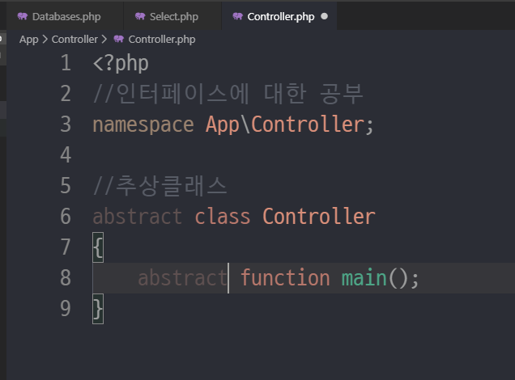 
--> abstract가 붙으면 추상 메서드, 추상 클래스로 사용 가능하다. 
--> interface는 무조건 추상 클래스 및 메서드로 이루어져 있다. 

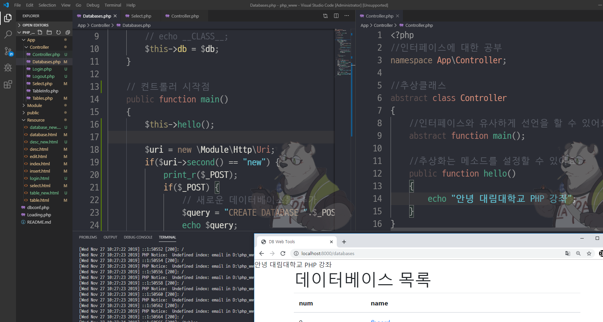 
--> 이렇게 만든 interface에 내용을 넣고 implements시킨 파일에서 $this->메서드명();을 이용하여 불러서 사용 할 수 있다. 

[쇼핑몰 제작해보기]  

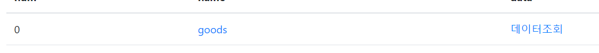 
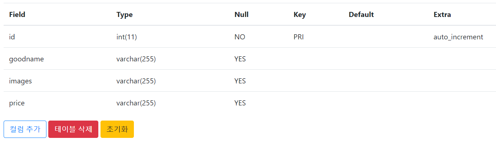 
--> 쇼핑몰 상품을 넣을 테이블 제작 및 컬럼 추가 

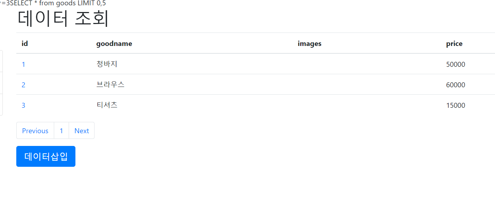 
--> 판매할 상품 데이터 추가 (사진은 주소로 추가) 

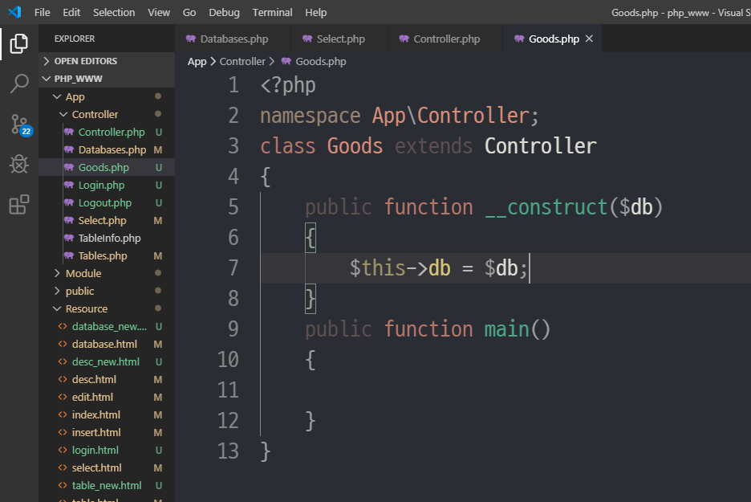 
--> 데이터를 뿌리고 꾸며줄 페이지 추가 및 디비 연동 

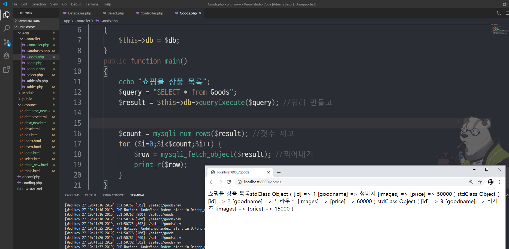 
--> 테이블 값 뿌려주기 

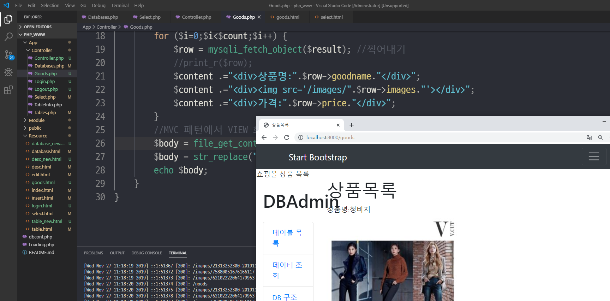 
--> img태그를 사용해서 images폴더 안에 있는 사진과 테이블에 있는 사진 주소를 연결하여 사진 뿌려주기 

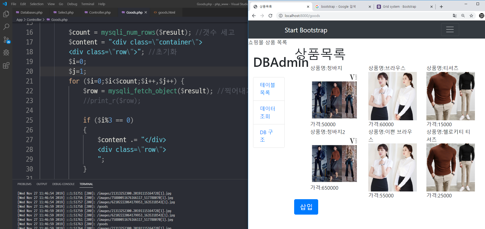 
--> 정렬해주기 

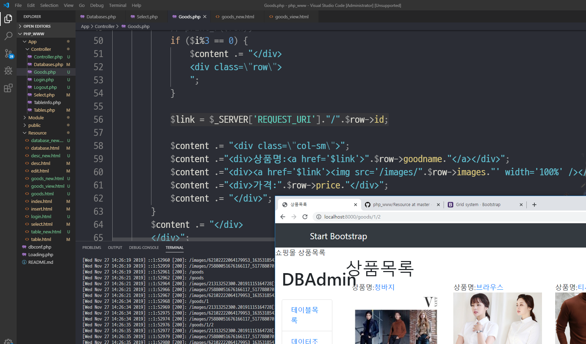 
--> 해당 상품명 클릭 시 상품 설명으로 이어지도록 링크 연결 

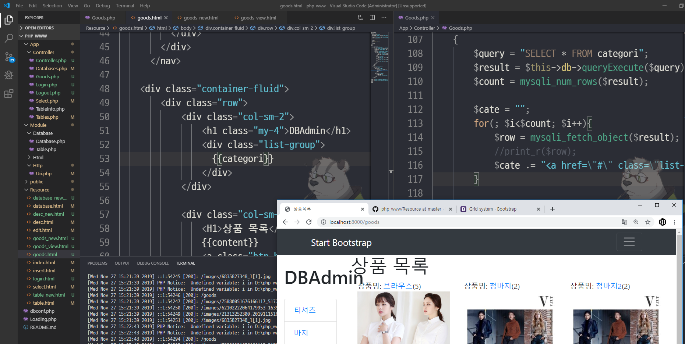 
--> 판매 카테고리 좌측 메뉴를 이용하여 제작 

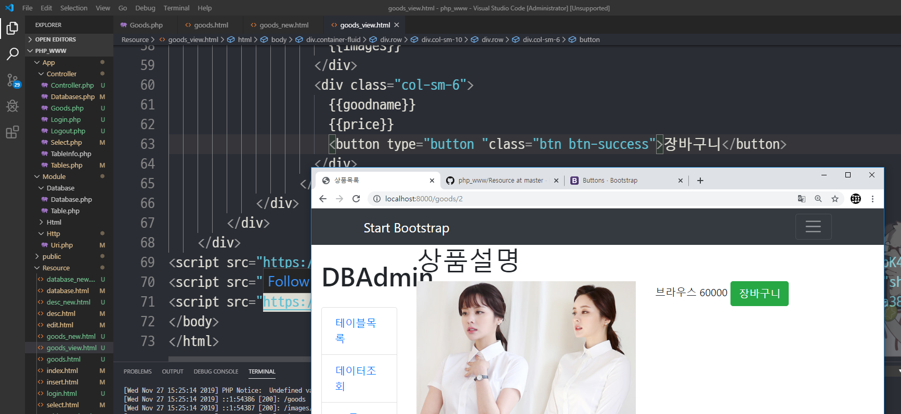 
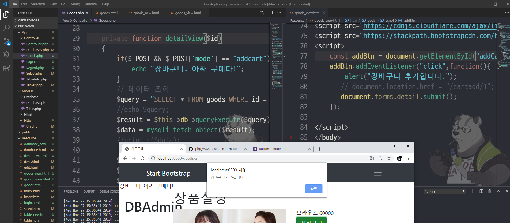 
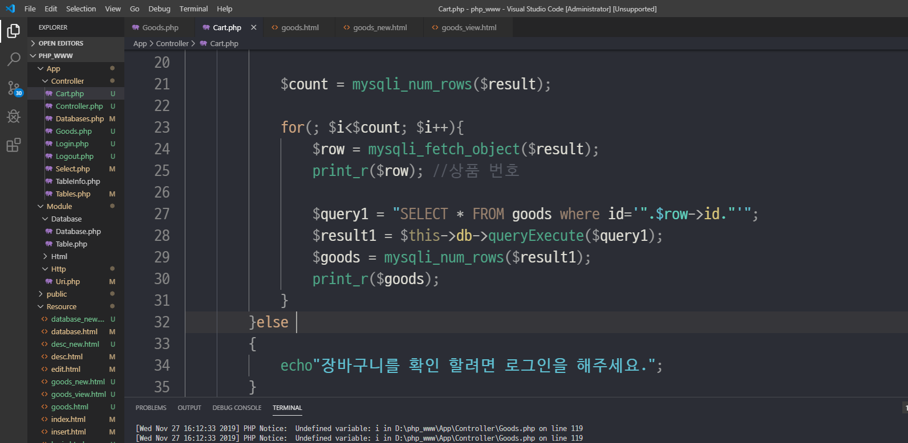 
--> 장바구니 버튼 제작 클릭 시 장바구니 추가 메세지 및 카트 테이블에 추가 